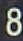
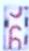
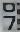
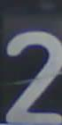
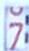

## Labeling of Digital Images

For the recognition algorithm it is important to get a clear reading and also to get the information, if the number is not totally clear at the moment of reading. Therefore I have decided to extend the 10 digits by one additional category - the so called NaN (Not a Number). As there are all kind of digit types and reading conditions, I needed to define an easy criteria for distinguish them. I have decided to use the following definition:

#### Good images:

- Only one number is visible
- Number is totally visible
- There is at least one pixel distance to the boundary of the image

##### Examples:

​			      

#### Bad image:

- Digit only partial visible
- Digit is toughing the boundary of the image

##### Examples:

​			        

#### Non Unique Images - not trained (!)

There are some "border" images, which are not totally clear. I have decided to exclude them for the moment from the training. Never the less, these images are collected for later usage.

##### Examples:

​			        
