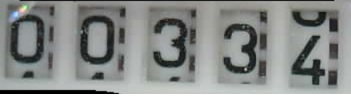
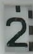
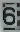
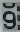

# neural-network-digital-counter-readout

Training and using a neural network to readout the value of a digital counter - example including small node server for demonstration

The readout is used in the [AI-on-the-edge-device](https://github.com/jomjol/AI-on-the-edge-device) project.

An overview of all training images can be found at [jomjol.github.io/neural-network-digital-counter-readout](https://jomjol.github.io/neural-network-digital-counter-readout).

# Versions

####  16.0.0 New Images (2023-01-13)

* New images (red on black)

####  15.1.0 New Images (2022-12-11)

* New LCD images (low contrast)

####  15.0.0 New Images (2022-11-20)

* New LCD images

####  14.4.0 Reactivate (2022-11-05)

* New LCD images

####  14.3.0 Reactivate (2022-09-28)

* New LCD images

####  14.1.1 Reactivate (2022-08-13)

* Update to new naming convention (not fully finished)
* New training data

####  14.0.0 Reactivate (2022-06-30)

* Update to Tensorflow 2.9
* Accumulated new images

####  13.3.0"Final" version (2021-12-24) 

* The training of the neural network for digital counters is transfered to an fully automated version:
  https://github.com/jomjol/neural-network-autotrain-digital-counter

#### [Overview older Versions](Versions.md)

## Problem to solve

An image of a number between 0 and 9 should be recognized and converted to the corresponding digital value. One complicating issue is, that as the digits are comming from a rolling counter number, there are some pictures, which are not ambigious. In this case the result should be a "NaN", indicating, that this is not a full number.
To solve this problem a neural network approach is used.

The rolling counter meter looks like following:

  

The image is sliced into individual pictures, which are analysed by a neural network.

## Neural Network Approach

Convolutional Neural Networks (CNN) are very promiment in image processing. Especially in classification of image content, e.g. identify objects (dog, cat, car, bike, ...) or classify hand written letters.

Here a classic approach is used to classify the picture into 11 output classes representing the 10 digits from 0 to 9 and the "NaN". 

| Picture        | Value           | Picture        | Value           | Picture        | Value           | Picture        | Value           |
| ------------- |:-------------:| ------------- |:-------------:|------------- |:-------------:| ------------- |:-------------:|
|  | 2 |  | 6 | | 9 |  | NaN |

### Labeled Training Data

The images are coming from a camera system described elsewhere ([Overview](https://github.com/jomjol/water-meter-measurement-system), [HW](https://www.thingiverse.com/thing:3238162), [SW](https://github.com/jomjol/water-meter-picture-provider)). One major effort is to label the pictures with the target value. The labeling is done by hand. For each digit about 150 images are collected. For the "NaN" category about 3700 images were taken. The picture are rescaled to 32x20 pixels with RGB color (3 channels).

The resized pictures as well as the original pictures (zipped in file "data_raw_all.zip") are included in the dataset. The pictures are stored in a subfolder for each digit (and NaN).

The criteria for "good" and "bad" images are described here: [Labeling-Criteria.md](Labeling-Criteria.md)

## Training the network

The training is done using Keras in a python environment. For training purpuses the code is documented in Jupyter notebooks. The environment is setup using Ananconda with Python 3.7[1]. 

The training is descibed in detail in an Jyupither Notebook: **[How to Train the Network](Train_Network.md)**.

The trained network is stored in the Keras H5-format and used as an input for a simple usage in the main project for a water meter readout: [https://github.com/jomjol/water-meter-system-complete](https://github.com/jomjol/water-meter-system-complete)

Hopefully you have fun with neural networks and find this useful. 

**Any questions, hints, improvements are very welcome through the GitHub channel**

Best regards,

**jomjol**

[1]: The following book is found very useful for background, basic setting and different approaches:  
Mattheiu Deru and Alassane Ndiaye: Deep Learning with TensorFlow, Keras, und Tensorflow.js

