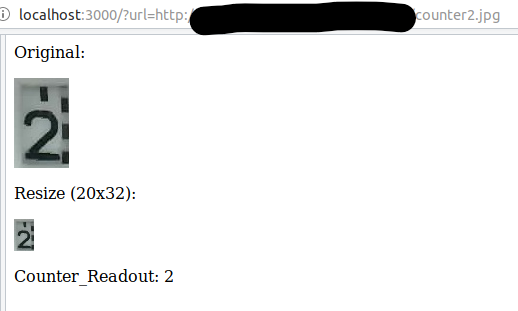

# Node server using an neural network with tensorflow
Details on setup and training of the CNN neural network

To run the node.js code copy the whole directory (minimum: server_digital_readout_converter.js) and the subdirectory "lib" and "image".

Path are relative, so it should run immediatly with the following command:
* `node server_analog_readout_converter.js`

### Remarks
* Python assumes some libraries to be installed using `pip`:
	* opencv4nodejs
	* @tensorflow/tfjs-node
	* @tensorflow/tfjs
	* jpeg-js
	
As most of the other system is encoded in node.js I decided not to directly use python, but instead set up the usage of the neural network in an node.js environment. The **tensorflow** library is also supported for node.js and beside installing the supporting libraries, there is only one barrier to overcome:

### Transfer the Python Keras output to tensorflow input
I cannot directly load the keras H5-Format to tensorflowjs. Therefore I need to convert it to a readable model description (model.json) and weight storage (group1-shard1of1.bin).

This is done in an python environment with the tensorflowjs library:
1. install tensorflowjs (`pip install tensorflowjs`)
2. Use Converter: `tensorflowjs_converter --input_format keras name.h5 export_directory`

Hint: the tensorflowjs package is not supporting Windows 10, so you need to run the above steps in another environment (e.g. ubuntu, ...).

### Server Usage

To run the node.js code copy the whole directory (minimum: server_digital_readout_converter.js) and the subdirectory "lib" and run it with the following code:

The server is listening to port 3000 and accepts requests in the following syntac:

http://server-ip:3000/?url=http://picture-server/image.jpg

* server-ip: address of the node-server running the script
* parameter "url": url to the picture to be analysed 

The output is the following:

   
   

