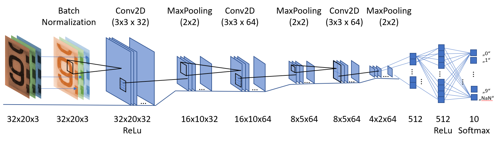

# Training the CNN neural network
Details on setup and training of the CNN neural network

## Software Environment
The training is done using Keras in a python environment. For training purpuses the code is documented in Jupyter notebooks. The environment is setup using Ananconda with Python 3.7.

## Network Structure
The network consists of several Conv2D, MaxPooling and Flatten Layers:

The structure was developed in an empirical way. 

## Training Data

The training data consists of images of the rolling counter meter a size of 20x32 pixels and RGB color code. The expected digital value is encoded in the subdirectory, in which the image is stored.

For reshaping the images the following code can be used: [Image_Preparation.ipynb](Image_Preparation.ipynb)

## Training strategy

The details can be found in the Jupyter file itself: ***[Train_CNN_Digital-Readout.ipynb](Train_CNN_Digital-Readout.ipynb)***

The following aspects are implemented:

#### Scattering input images
Scattering the input images by brightness, pixel shift, rotation and zooming for training variations improved the stability of the network a lot.

* Brightness was scattered with +/-30%

* The position was scattered with +/-1 pixel in each direction. 
As the original picture is almost 3 times bigger (55x90 pixel) this ensures enough uncertainty to the upstream image alignment and cut out procedure.

* The rotation is scattered for +/-10°

* The zooming is changing vom 60% to 140%.

Examples of an augumented picture can be seen here:

